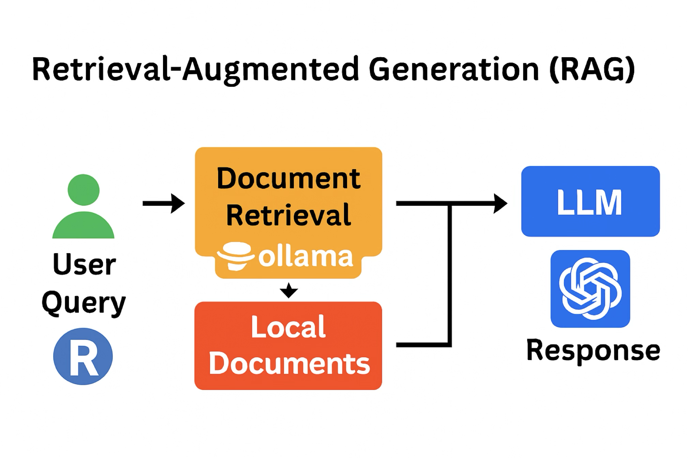

```{css, echo=FALSE}
.title {
  color: #708090; /* Slate Gray */
  font-weight: bold;
  font-family: "Helvetica Neue", Helvetica, Arial, sans-serif;
}
.author, .date {
  color: #8F8F8F; /* gray56 */
  font-weight: bold;
  font-family: "Helvetica Neue", Helvetica, Arial, sans-serif;
}

h2, h3 {
  color: #899499;
  font-weight: bold;
}
```


## Motivation
<div style="display: flex; align-items: flex-start; gap: 2em;">

<div style="flex: 2;">
<p>
I've been exploring how AI can be made more useful in offline, locally controlled environments — especially when working with sensitive data like medical records, financial reports, or culturally specific archives. In these cases, privacy isn’t just a preference — it’s essential.

Most Large Language Models (LLMs), including ones like ChatGPT, are trained on vast public datasets. That means they can’t access or respond to your private, local information unless you explicitly provide it. This is where **Retrieval-Augmented Generation (RAG)** comes in — a method that lets you enrich an LLM’s responses by feeding it your own documents at query time.

Think of it like giving your model a **bookshelf** to browse before it speaks. Instead of relying solely on what it “remembers” from training, it can scan your handpicked sources — PDFs, notes, datasets — and weave that knowledge into its answers. The result: responses that are more grounded, relevant, and tailored to your context.

To test this out, I used a **locally hosted LLM** via [Ollama](https://ollama.com/) — specifically the `qwen2.5:7b` model. Running the model locally means everything stays on your machine, with no cloud dependency — ideal for privacy, speed, and control.

I connected a few sample documents to the model using RAG, and used the `ellmer` package to inspect how well it retrieved and responded. This gist walks through that workflow — not too technical, just enough to help others try it out and adapt it to their own use cases.
</p>
</div>

<div style="flex: 1;">
```{r fig1, echo=FALSE, out.width="150%", fig.cap="Fig 1. A high-level flowchart showing how a user query (via R) connects to local documents through Ollama’s retrieval layer, then passes to a locally hosted LLM (e.g., chatGPT, quemu) to generate a response."}

```
</div>

</div>
---

## Assumptions & Workflow Overview

This gist assumes you’ve already set up a local LLM using [Ollama](https://ollama.com/) and the `qwen2.5:7b` model. If you're comfortable running queries locally and have Ollama installed, you're good to go.

> 💡 **Note**  
> This workflow was tested in an R environment with the following packages loaded:  
> - `ellmer` for RAG implementation and response inspection  
> - `dplyr` for data wrangling and pipeline operations  
> Make sure these packages are installed and loaded before running the code chunks.

The walkthrough includes:
1. Preparing sample documents  
2. Generating a vector index using GloVe embeddings via `text2vec`  
3. Implementing RAG with `ellmer` and querying the local LLM  
4. Testing and verifying responses  
5. Reflecting on takeaways and next steps

---

## 📄 1. Prepare Sample Documents

### Objective  
Create two sample `.txt` files to simulate local documents for retrieval.

- **Sample document `doc1.txt`**:
```
Sales Report - Q3 2025
Revenue generated: $7500
Date: 2025-09-10
Key product: Widget A
Notes: Strong demand in the eastern region.
Market analysis shows a 15% growth in sales.
Customer feedback highlights product durability.
Eastern region accounts for 40% of revenue.
New marketing campaign launched last month.
Inventory restocked on 2025-09-05.
Competitor activity remains low in this quarter.
```

- **Sample document `doc2.txt`**:
```
Financial Update - Q4 2025
Revenue generated: $9200
Date: 2025-09-12
Key product: Widget B
Notes: Inventory levels are stable.
Profit margins improved by 8% this quarter.
Widget B sales spiked after the trade show.
Western region contributed 35% of revenue.
Supply chain delays resolved by 2025-09-08.
Customer retention rate is at 90%.
Planning a product launch for next month.
```

---

## 2. Index Documents with Embeddings

### 📦 Package Overview

This section uses three key R packages to build a semantic index of your documents:

- **`text2vec`**: Handles tokenization, vocabulary creation, and GloVe-based word embeddings  
- **`dplyr`**: Powers the data wrangling pipeline for filtering, grouping, and summarizing  
- **`ellmer`**: Later used to connect your query to the index and inspect retrieval behavior

> This gist assumes you're already familiar with basic R workflows and tidyverse-style syntax.  
> For deeper technical details on `text2vec`, see: [https://cran.r-project.org/package=text2vec](https://cran.r-project.org/package=text2vec)

---

### Objective  
Generate a vector index of document embeddings using `text2vec` and GloVe — enabling semantic retrieval for RAG.

### Workflow

```r
# Load and preprocess documents
docs <- tibble(
  id = c("doc1", "doc2"),
  text = c(
    paste(readLines("doc1.txt"), collapse = "\n"),
    paste(readLines("doc2.txt"), collapse = "\n")
  )
)

# Tokenize and filter stop words
tokens <- docs %>%
  unnest_tokens(word, text) %>%
  filter(!word %in% stop_words$word)

# Reconstruct document texts
docs_by_id <- tokens %>%
  group_by(id) %>%
  summarise(text = paste(word, collapse = " "), .groups = "drop")

# Create token iterator
it <- itoken(docs_by_id$text, progressbar = TRUE)

# Build vocabulary and vectorizer
vocab <- create_vocabulary(it)
vectorizer <- vocab_vectorizer(vocab)

# Create term co-occurrence matrix
tcm <- create_tcm(it, vectorizer, skip_grams_window = 2L)
print(dim(tcm))

# Train GloVe model
glove <- GlobalVectors$new(rank = 30, x_max = 10, learning_rate = 0.05)
word_vectors <- glove$fit_transform(tcm, n_iter = 10, convergence_tol = 0.1)

# Create document-level embeddings
doc_embeddings <- tokens %>% 
  left_join(as_tibble(word_vectors, rownames = "word"), by = "word") %>% 
  group_by(id) %>% 
  summarise(across(where(is.numeric), mean, na.rm = TRUE), .groups = "drop") %>% 
  column_to_rownames("id")

index <- list(
  embeddings = as.matrix(doc_embeddings),
  ids = rownames(doc_embeddings),
  texts = docs$text
)
```

---

## 3. Implement RAG with `ellmer`

### Objective  
Augment LLM responses with document context for accurate, grounded answers.

```r
# Load ellmer and initialize chat object
library(ellmer)
chat <- chat_ollama(model = "qwen2.5:7b", base_url = "http://localhost:11434")

# Query with doc1 context
query <- "What was the revenue in Q3 2025?"
relevant_doc <- list(id = "doc1", text = index$texts[index$ids == "doc1"])
augmented_prompt <- paste(relevant_doc$text, "\nQuestion:", query)
response <- chat$chat(augmented_prompt)
print(response)

# Query with doc2 context
query <- "What was the revenue in Q4 2025?"
relevant_doc <- list(id = "doc2", text = index$texts[index$ids == "doc2"])
augmented_prompt <- paste(relevant_doc$text, "\nQuestion:", query)
response <- chat$chat(augmented_prompt)
print(response)

# Query with both documents
query <- "What were the revenues for Q3 and Q4 2025?"
relevant_doc1 <- list(id = "doc1", text = index$texts[index$ids == "doc1"])
relevant_doc2 <- list(id = "doc2", text = index$texts[index$ids == "doc2"])
augmented_prompt <- paste(relevant_doc1$text, "\n", relevant_doc2$text, "\nQuestion:", query)
response <- chat$chat(augmented_prompt)
print(response)
```

---

## Conclusion

This workflow demonstrates how Retrieval-Augmented Generation (RAG) can extend the capabilities of a locally hosted LLM by integrating your own documents and data into its responses. Instead of relying solely on what the model was trained on, RAG allows you to enrich its output with context-specific, private, or domain-relevant information — all without sending anything to the cloud.

The result is a more grounded, responsive, and customizable AI experience — one that respects privacy, adapts to your local needs, and opens new possibilities for offline data interaction.

> 💡 **Note**  
> While this setup works well for prototyping and exploration, production use may require more robust testing, performance tuning, and system resources. Depending on your data size and model complexity, additional RAM, CPU, or GPU capacity might be needed to ensure smooth operation.

---

<!-- End of document -->

